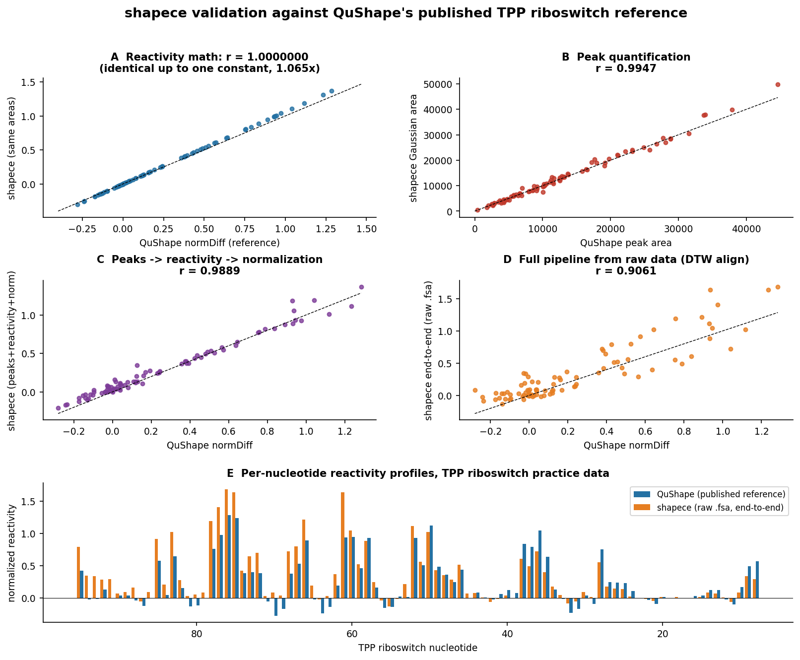

# Validation against QuShape's published TPP-riboswitch reference

`shapece` is a reimplementation, so its correctness must be demonstrated, not asserted.
QuShape ships a **finished** analysis of a TPP riboswitch (`TPP_Practice_Data/test1001_done.qushape`)
next to the raw traces it was derived from. That file is a Python-2 `shelve` (Berkeley DB) holding the
published peak positions and areas, the background-subtracted reactivity (`areaDiff`), and the
normalized reactivity (`normDiff`) for 88 nucleotides (RNA positions 95 → 8).

We reproduce that reference at four increasing levels of strictness. All four are automated in
[`tests/test_validation_tpp.py`](../tests/test_validation_tpp.py) and pass.



## Level 1 — Reactivity arithmetic is exact

Least-squares recovery of QuShape's own relation gives

```
areaDiff = 1.0000 x area(RX) − 1.0000 x area(BG)     (residual 4.7e−21)
```

i.e. QuShape applies its background scale factor (here 0.82) to the **background trace before peak
fitting**, and `areaDiff` is then a plain subtraction. `shapece` does the same.

## Level 2 — Normalization reproduces `normDiff` exactly, up to one constant

Feeding QuShape's own `areaDiff` into `shapece.reactivity.boxplot_normalize` gives

```
Pearson r vs published normDiff = 1.0000000000
```

so the two are **identical in shape**. The normalization *divisor* differs by 6.5%
(22 340.10 vs 23 787.29). We traced this precisely:

- The reference project's divisor corresponds to `NAver = 10, NOutlier = 1` — the mean of the
  9 largest values after discarding the single largest.
- The **current** published `findPOutlierBox` source, run on these same data, finds **2** values above
  the boxplot threshold (Q3 + 1.5·IQR = 29 166.75; the top two values are 29 352.0 and 30 549.1),
  giving `NOutlier = 2, NAver = 12`.

So the shipped reference file was produced by an **earlier QuShape build** than the source in the
repository. This is a discrepancy *within QuShape's own artifacts*, not an error in this port.
`shapece` implements the **current published source** verbatim (including its `N < 100` rule, where
"top 10%" becomes "top 10 values", and its integer-truncation behavior).

> **Practical note.** Because normalization is a single global divisor, this affects the absolute
> scale of reactivities by ~6%, not their relative pattern, and it does not change which nucleotides
> are reactive. Users comparing to legacy QuShape numbers should be aware of it.

## Level 3 — Peak quantification agrees

Running `shapece`'s iterative Gaussian deconvolution on QuShape's *own* preprocessed traces, at
QuShape's *own* peak positions:

| quantity | Pearson r | Spearman r |
|---|---|---|
| RX peak areas | **0.9947** | 0.9952 |
| BG peak areas | **0.9927** | 0.9917 |

Chaining peaks → reactivity → normalization on those traces reproduces the published profile with
**r = 0.9889** (Spearman 0.9776), and recovers a background scale factor of **0.807** vs QuShape's 0.82.

## Level 4 — End-to-end from the raw `.fsa` files

Starting from `TPP_+1M7.fsa` and `TPP_DMSO.fsa` with no information from the reference project except
its region of interest:

- Independent preprocessing (saturation → smooth → baseline) reproduces QuShape's stored preprocessed
  trace at **r = 0.90** (ROI offset 1329).
- These data carry **no internal size standard**, so lanes are co-registered with the QuShape-style
  **banded dynamic time warping** on the shared ddC ladder channel. Ladder agreement improves from
  **r = 0.43 → 0.986**, confirming the alignment works.
- Final reactivity vs the published `normDiff`: **Pearson r = 0.9061**, Spearman 0.8490.
- With **fully independent peak detection** (no reference positions used), 78/88 reference peaks are
  recovered within ±4 samples, and the matched reactivities correlate at **r = 0.8869**
  (Spearman 0.8530).

The residual difference at Level 4 is expected and attributable to preprocessing choices that QuShape
made through its GUI (mobility-shift and signal-decay correction with interactively chosen parameters)
that we do not attempt to replay exactly.

## Reproducing these results

```bash
git clone https://github.com/Weeks-UNC/QuShape.git
apt-get install -y libdb-dev && pip install bsddb3   # to read the Python-2 reference project
QUSHAPE_DIR=QuShape/TPP_Practice_Data pytest tests/ -q
```

## Summary

| Level | What is tested | Result |
|---|---|---|
| 1 | reactivity arithmetic | exact (residual 5e−21) |
| 2 | boxplot normalization | r = 1.0000000000 (constant offset explained) |
| 3 | Gaussian peak areas | r = 0.9947 / 0.9927 |
| 3 | peaks → reactivity → norm | r = 0.9889 |
| 4 | raw `.fsa` → reactivity | r = 0.9061 |
| 4 | + independent peak detection | r = 0.8869, 78/88 peaks matched |
